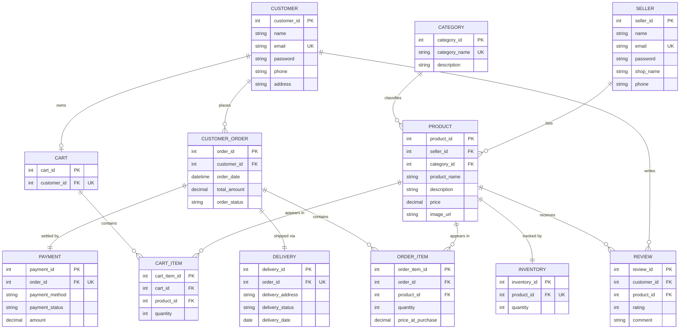

# ER Diagram — E-Commerce Management System

This diagram is written in Mermaid syntax. It renders automatically when viewed on GitHub.

## Cardinality Notes

- **CUSTOMER to CART**: one-to-one — each customer has exactly one active cart.
- **CUSTOMER to CUSTOMER_ORDER**: one-to-many — a customer can place many orders.
- **SELLER to PRODUCT**: one-to-many — a seller can list many products.
- **CATEGORY to PRODUCT**: one-to-many — a category groups many products.
- **PRODUCT to INVENTORY**: one-to-one — each product has exactly one stock record.
- **CART to CART_ITEM**: one-to-many — a cart holds many line items.
- **CUSTOMER_ORDER to ORDER_ITEM**: one-to-many — an order holds many line items.
- **CUSTOMER_ORDER to PAYMENT**: one-to-one — each order has exactly one payment record.
- **CUSTOMER_ORDER to DELIVERY**: one-to-one — each order has exactly one delivery record.
- **CUSTOMER/PRODUCT to REVIEW**: many-to-many, resolved through REVIEW as an associative entity (one review per customer per product, enforced by a UNIQUE constraint).
